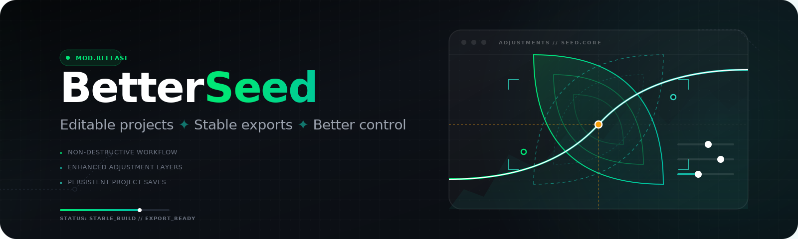

  

<h1 align="center">BetterSeed</h1>

  <strong>A practical Snapseed mod for editable projects, safer exports, and power-user controls.</strong>

  Keep the familiar Snapseed workflow where it already works. Extend the parts that matter for real project reuse, exact control, and stable export behavior.

  
  
  
  
  

  <a href="docs/install.md">Install</a>
  ·
  <a href="docs/features.md">Features</a>
  ·
  <a href="docs/faq.md">FAQ</a>
  ·
  <a href="docs/development.md">Development</a>
  ·
  <a href="NOTICE.md">Notice</a>
  ·
  <a href="CHANGELOG.md">Changelog</a>

BetterSeed is an independent Snapseed mod release line focused on keeping the app practical, editable, and export-safe. This repository is the standalone public home for releases, install docs, changelog, and project-level notes.

If stock Snapseed is your reference point, the BetterSeed approach is narrow on purpose: preserve the original flow where it already works, then patch the seams that actually block day-to-day project work.

## Why People Use It

- Separate BetterSeed package identity
- Stock photo picker restored for normal open
- Separate Open project entry in both Home and editor toolbar
- Editable `.snpsd` save/open flow
- Save project stays in the editor
- Reopened projects stay editable while regular photo export still works
- Embedded source kept, `edits_cache` removed
- `.bslook` import/export
- Preview fidelity improvements
- Curves 99 support
- Configurable global range expansion and boundary setting
- No-resize full-res export fix
- `Export as -> SAVE` fixed
- View edits delete/edit roundtrip fixes
- Shared numeric controls with exact value entry and hold-repeat
- BetterSeed-only custom UI language defaulting to English outside `ru`, with `ru` overrides
- Author channel link

## What The New Features Actually Do

- `Editable .snpsd projects` let you save work as a real project, reopen it later, and continue editing instead of being stuck with a flat exported image.
- `Open project` gives project files their own entry point, so normal photo opening stays simple and project reopening stays predictable.
- `Embedded source, no edits_cache` keeps the project self-contained and portable without dragging along the temporary cache that used to get in the way.
- `No-resize full-res export` removes the hidden export cap that could silently shrink large images even when you expected full size.
- `Export as -> SAVE fix` makes folder-based export finish cleanly instead of throwing you back to the home screen with a load error.
- `View edits roundtrip fixes` mean deleting or reopening a history step now survives the return back to the editor instead of getting lost.
- `Numeric controls` add `- / value / +`, hold-repeat, and exact number input for tools where the stock slider was too vague.
- `Global range expansion` widens the allowed adjustment range when the stock limits are too conservative.
- `.bslook`, `Curves 99`, and `preview fidelity` improve reusable looks, give more room for curve work, and keep the on-screen preview closer to the real result.
- `Localized BetterSeed UI` keeps BetterSeed-specific additions in English by default outside `ru`, while preserving explicit Russian wording for the Russian locale.

## Current Canon

Accepted baseline:

- Build: `20260410T094706Z`
- SHA-256: `4ebfddcd5beb41cfd76e04a28d8e7d5b96061e6e25a4abb5adb72307fc9c5516`

This is the current accepted release line. If a later release is published, the release page becomes the source of truth for the newest public artifact.

## Install

Follow [docs/install.md](docs/install.md) for the current release path.

## Integrity

Accepted release checksum:

- Build: `20260410T094706Z`
- SHA-256: `4ebfddcd5beb41cfd76e04a28d8e7d5b96061e6e25a4abb5adb72307fc9c5516`

Verify the downloaded artifact before installing it.

## Disclaimer

BetterSeed is an independent Snapseed mod. It is not affiliated with Google. Public releases may evolve conservatively; release stability is prioritized over shipping every experiment.

## License And Project Note

Repository-authored public materials are released under GPL-3.0. BetterSeed is published as a free hobby release; the author does not monetize this project and does not offer paid commercial licensing, paid support, or commercial endorsement through this repository.

See [NOTICE.md](NOTICE.md) for scope and wording.
